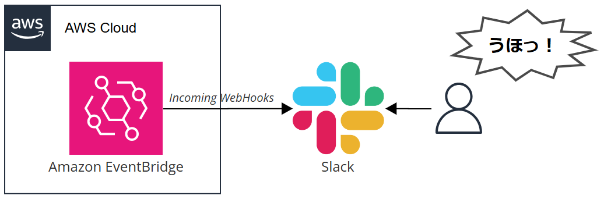
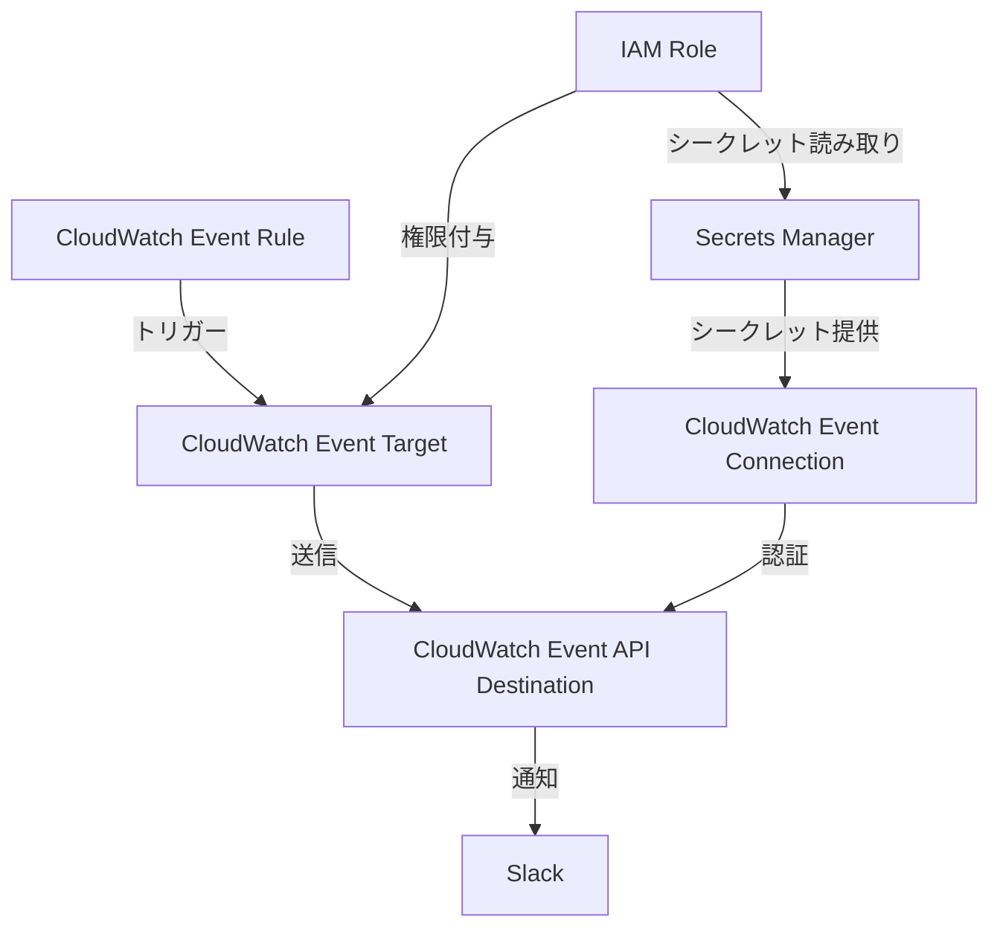
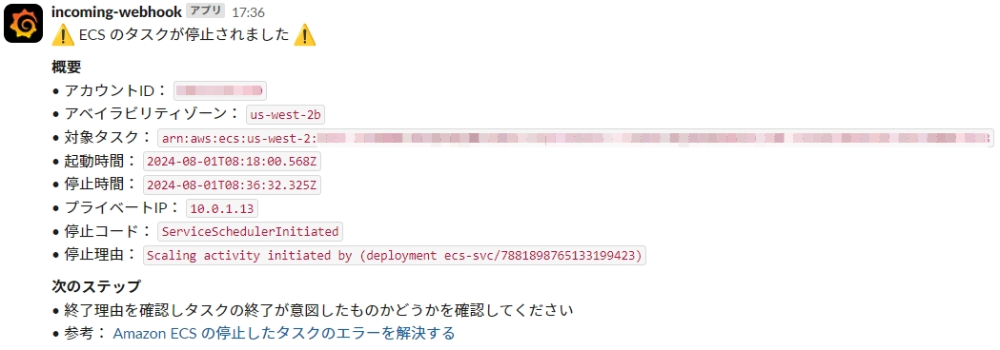

# AWS ECS タスク監視 Slack 通知システム

このリポジトリには、AWS ECS タスクの状態変更を監視し、Slack に通知を送信する自動化されたシステムを構築するための Terraform コードが含まれています。

## 概要

このプロジェクトは以下の機能を提供します：

- AWS ECS タスクの状態変更の監視
- CloudWatch Events と EventBridge を使用したイベントの捕捉
- Slack への通知送信

## アーキテクチャ

以下は、このシステムのアーキテクチャ概要図です：



このアーキテクチャは以下の主要コンポーネントで構成されています：

1. Amazon EventBridge: ECSタスクの状態変更イベントをキャプチャ
2. Slack: 通知を受け取るプラットフォーム

このシステムにより、ECSタスクの状態変更がリアルタイムで監視され、即座にSlackチャンネルに通知されます。

## ダイアグラム

ダイアグラムは以下のとおりです：



## 前提条件

- AWS アカウント
- Terraform v1.9.3 以上がインストールされていること
- AWS プロバイダー v5.60.0 以上
- Slack ワークスペースと通知用のWebhook URL

## 動作確認済み環境

- Terraform v1.9.3
- AWS プロバイダー v5.60.0

## セットアップ

1. このリポジトリをクローンします。
2. `terraform.tfvars` ファイルを作成し、必要な変数を設定します。
3. `terraform init` を実行して Terraform を初期化します。
4. `terraform plan` を実行して変更内容を確認します。
5. `terraform apply` を実行してインフラストラクチャをデプロイします。

## terraform.tfvars のサンプル

以下は `terraform.tfvars` ファイルのサンプルです。このファイルを作成し、ご自身の環境に合わせて値を設定してください。

```hcl
aws_region         = "ap-northeast-1"
slack_webhook_url  = "https://hooks.slack.com/services/XXXXXXXXX/YYYYYYYYY/ZZZZZZZZZZZZZZZZZZZZZZZZ"
cluster_name       = "my-ecs-cluster"
```

各変数の説明：

- `aws_region`: AWSリージョン（例：東京リージョン）
- `slack_webhook_url`: Slack通知用のWebhook URL
- `cluster_name`: 監視対象のECSクラスター名

## 使用方法

システムがデプロイされると、ECS タスクの状態が変更されるたびに自動的に Slack 通知が送信されます。



## カスタマイズ

通知メッセージや監視するイベントタイプは、Terraform コード内で簡単にカスタマイズできます。

## ライセンス

このプロジェクトは [MITライセンス](LICENSE) の下で公開されています。

## 貢献

プルリクエストや問題報告は大歓迎です。大きな変更を加える前に、まずは Issue でディスカッションを開始してください。
